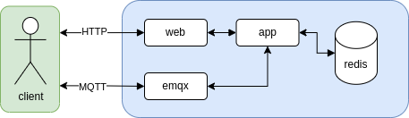

# datahub (Redis version)

## About
A fast database with a Web UI to hold your IoT data.
Use the REST API to store and retrieve time series
of numbers or use the built-in MQ broker to publish
or subscribe to your data.

## Background
I have many IoT devices generating data and need to store that
data somewhere. After searching I did not find any existing
projects or free/cheap services the offered the simplicity I
was looking for so I decided to write my own IoT database.

## History
This is a re-design of my previous project [datahub](https://github.com/fjaderboll/datahub), which is based on SQLite and PHP.
Check this out if you want something that can be deployed simply on a web server.

## Overview

## Entities
Structure of entities with examples:

## File structure
This project consists of two parts:
* [app](app/README.md) - The application backend (where it all happens)
* [web](web/README.md) - The web frontend (administration and viewing data)

## Running
See [docker](docker/README.md) how to deploy using Docker.
