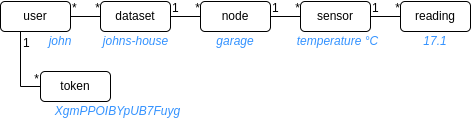

# datahub (Redis version)

## About
A database with REST API to store and retrieve time series
of numbers, with a Web UI for viewing and administration.

## Background
I have many IoT devices generating data and need to store that
data somewhere. After searching I did not find any existing
projects or free/cheap services the offered the simplicity I
was looking for so I decided to write my own IoT database.

## History
This is a re-design of my previous project [datahub](https://github.com/fjaderboll/datahub)
with a Redis database instead of SQLite. This has the benefits of greatly improved speed, parallelism and
less wear on your disk.

## File structure
This project consists of two parts:
* [app](app/README.md) - The application backend
* [web](web/README.md) - The web frontend (optional, but convenient for setup and viewing data)

## Entities
Structure of entities with examples:

## Running
See [docker](docker/README.md) how to deploy using Docker.

## TODOs
* write more Swagger doc
* create insert readings endpoints (allow arrays of values)
* sharing datasets to other users
* don't allow deleting users if results in orphaned datasets
* export readings to MQ broker
* import readings from MQ broker
* make Web UI work better on smaller screens
* use built-in default retention instead of custom key
